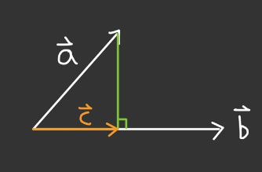

# 宇研共創 
## 定翼飛機系統工程設計
###### `無人機` `飛行動力` `動態模擬`

### Modelica 模型

- AircraftDynamics
- FluidSystemComponents
- PropulsionSystem

### 名詞
Flap 襟翼  
Aileron 副翼  
Tnadem Wing 串翼機 
Rudder 方向舵  
Elevator 升降舵  
Spoiler 擾流板  
Angle of Attack 攻角  
Chord Line 弦線  
Airfoil 翼型  
Mean Camber Line 中弧線  

### 重要數值
推力:曲線(油門) 
升力系數$C_l$ 
升力系數&攻角 
阻力系數&攻角 
升阻比&攻角 
投影面積與攻角成正比 

### 公式 
$L= C_L\left({\frac1 2}\rho V^2\right)S$  
L:升力  
$C_L$ : 升力系數  
$\rho$ : 空氣密度  
$V$ : 相對於空氣的飛行速度  
$S$ : 機翼投影面積  
  

### 定義
機體座標系 B  
地球座標系 E  
$v = \left[u,v,w\right]^T$  
$\omega = \left[p,q,r\right]^T$  
攻角 $\alpha$  
空速 V  
風軸横滾率 $P^{\left(W\right)}$  
$$\alpha = \tan^{-1}\left(\omega/u\right)$$
$$V = \sqrt{u^2+v^2+w^2}$$
$$p^{\left(w\right)} = {\frac 1 V}u^T\omega$$

$\alpha_0$ : 零升力攻角  
$Cl_\alpha$: 升力曲線斜度  
$Cl_i$:升力系數在阻力最小位置 
 
通常:  
$馬赫數M=0.2$  
$雷諾數R_e=9 \times 10^6$ 

力及力矩平衡

### 向量計算

> $若 \vec a = \{x_1,y_1\}, \vec b = \{x_2,y_2\}$
>
> $ 點積(內積) \quad \vec a \cdot \vec b = x_1 x_2 + y_1 y_2$

> $若 \vec a = \{a_1,a_2,a_3\}, \vec b = \{b_1,b_2,b_3\}$
>
> $叉積(向量積) \quad \vec a \times \vec b = (a_2 b_3 - a_3 b_2 , -a_1 b_3 + a_3 b_1 , a_1 b_2 - a_2 b_1)$

>  
> $正射影長度: |\vec c| = \frac {\vec a \cdot \vec b} {|\vec b |}$
>
> $正射影向量: \vec c = {\frac {\vec a \cdot \vec b} {\vec b \cdot \vec b}} \vec b, 若\vec b 為單位向量,則$
>
> $\vec c =({\vec a \cdot \vec b}) \vec b$

### AOA(攻角)

 $世界座標系: \{ x',y',z' \}$

 $機體座標系: \{ x,y,z\} , 法向量: \vec n , 各軸單位向量分別為 \{\vec u, \vec v, \vec w\}$

$飛機速度: \vec V$ 

$\vec n' 為速度 \vec V 投影至法向量 \vec n 若:$

$\vec n' \cdot \vec n > 0 則同向AOA為正,反之AOA為負 $ 

$\vec V 投影至x,y平面為向量\vec V'=(\vec V 投影至 \vec u) + (\vec V 投影至 \vec v)$

